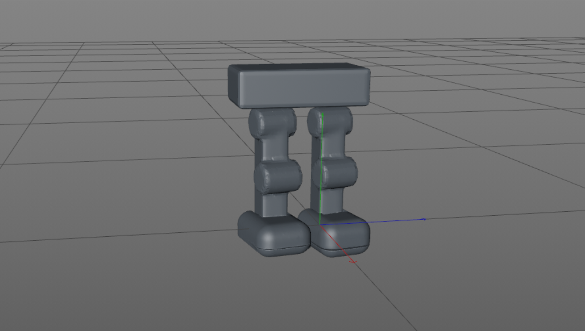

# Build-Robot-Legs
 

## About this repository❓ 

### This repository includes my work on the first task in Mechanical engineering, Which is build a two robot leg .  
 

## Robot leg 🦿:  
 
### is a mechanical leg that performs the same functions that a human leg can   
  

## Here is the view of the robot legs🔍:  

